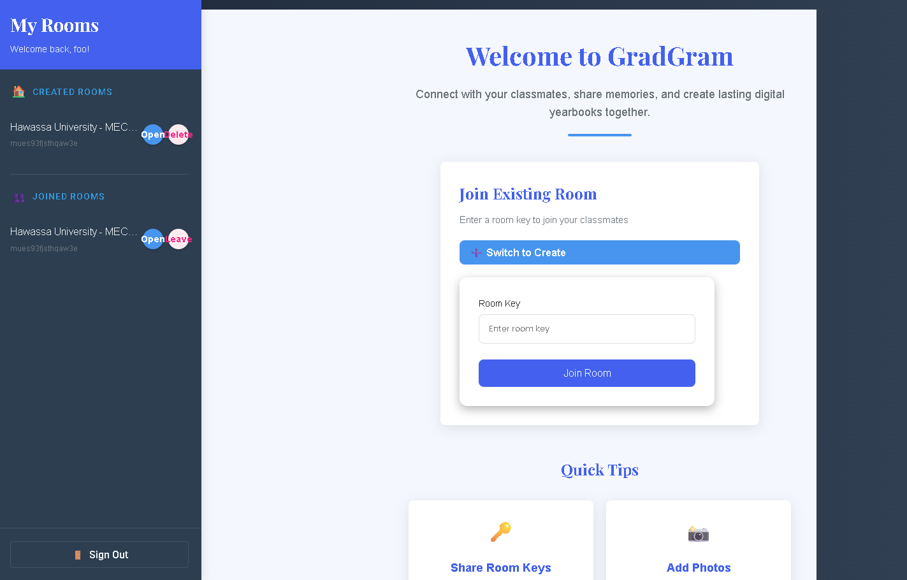

# 🎓 GradGram

**GradGram** is a full-stack university photo and memory sharing app for graduates. It enables students to create private department-based rooms, share graduation photos, post heartfelt messages, and engage in memory-filled chats — all in one place.

Built with **React + Firebase**, GradGram provides an intuitive interface and secure room-based interactions, helping graduates capture and preserve the most memorable moments of their university life.

---

## 🖼️ Screenshots

| Home Page                                                                                                       | Post List                                                                                                           | Room Chat                                                                                                       |
| --------------------------------------------------------------------------------------------------------------- | ------------------------------------------------------------------------------------------------------------------- | --------------------------------------------------------------------------------------------------------------- |
| | |  |

---

## 🚀 Features

### 🔐 Authentication

- Google & Email/Password sign in
- Role-based access with room-specific permissions

### 📷 Grad Photo Sharing

- Upload graduation images with last words
- See all posts in a clean gallery or list view

### 🧑‍🎓 Room Management

- Create or join rooms using a `room key`
- Departments and years are handled by secure keys
- Creator can delete room; users can leave room

### 🗣️ Interaction & Chat

- Post comments under each photo
- Chat with other members in the room
- React to posts and comments

### 🎨 UI Features

- Mobile-first responsive layout with Tailwind CSS
- Custom room background support (image or color)
- Light and dark modes

---

## 🧠 Tech Stack

| Layer         | Tools                     |
| ------------- | ------------------------- |
| Frontend      | React, Tailwind CSS       |
| Backend       | Firebase Auth & Firestore |
| Image Hosting | Cloudinary                |
| Deployment    | Vite, Render              |

---
